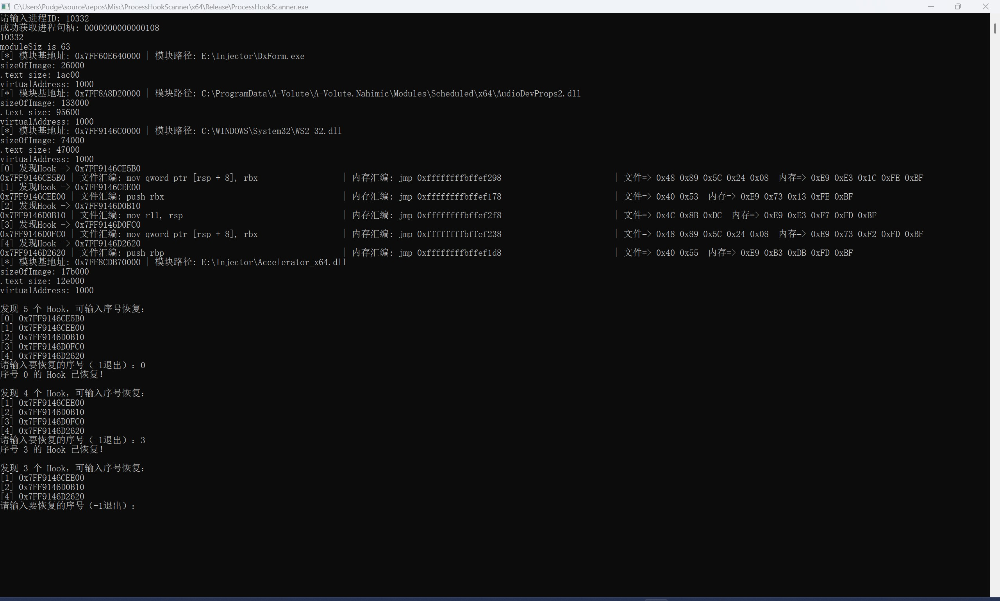

# HookScanner

HookScanner scans all inline hooks(only E9+offest) for all modules or the specifics,and provides restoring hooks.

Cheat Engine has supported more powerful features to scan patches, but when i knew this thing,i decide to stop developing this tool

Somt Rootkits also support these features,like Winark,Pyark...

# 项目效果

